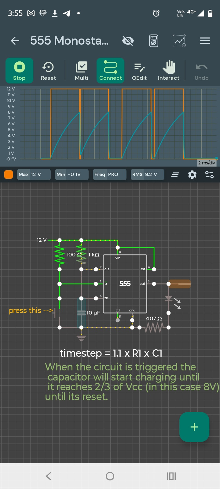

This is a great idea for a GitHub repository! A tutorial on moving from **Analog Oscillators** to **Integrated Timing Circuits** covers a lot of fundamental ground.
Here is a structured README.md template you can use for your project.
# From Sine Waves to One-Shots: A 555 & Wien Bridge Tutorial
This repository documents the transition from generating continuous analog signals to precision timing using the 555 Timer.
## 1. The Wien Bridge Oscillator
The first stage of this project focuses on generating a clean sine wave using an Op-Amp.
### Circuit Theory
The frequency is determined by the resonant frequency of the RC network:

 * **Positive Feedback:** The series and parallel RC branches.
 * **Negative Feedback:** A resistor divider that must maintain a gain of exactly **3**.
 * **Stabilization:** To prevent clipping, we use back-to-back diodes in the feedback path to "soft-limit" the amplitude.
## 2. The 555 Monostable (One-Shot)
The second stage moves into pulse timing. A Monostable circuit produces a single output pulse of a fixed duration when triggered.
### The Timing Formula
The duration of the pulse (T) in seconds is defined by:

### 5-Minute Delay Configuration
To achieve a long-duration delay (approx. 300 seconds), we use high-impedance components:
 * **Resistor (R):** 2.7\text{ M}\Omega
 * **Capacitor (C):** 100\text{ }\mu\text{F}
> [!IMPORTANT]
> For delays this long, use a **CMOS 555 variant** (e.g., LMC555) to avoid trigger errors due to high input impedance, and ensure your capacitor is a **low-leakage** type.
> 
## 3. Simulation vs. Real World
| Feature | Simulation | Real World |
|---|---|---|
| **Gain Stability** | Perfect | Requires Diodes/Thermistor |
| **Capacitor Leakage** | 0\text{ nA} | Significant over 5+ mins |
| **Component Tolerance** | 0\% | \pm 5\% to \pm 20\% |
## How to Use
 1. **Clone the repo:** git clone https://github.com/your-username/555-timing-tutorial.git
 2. **Open Simulations:** Load the provided .json or .asc files into your preferred simulator (EveryCircuit, LTSpice, etc.).
 3. **Build:** Follow the schematics in the /schematics folder to build these on a breadboard.
## Future Improvements
 * [ ] Add a Potentiometer for adjustable timing (0 to 10 minutes).
 * [ ] Implement a "reset" button to cancel the 5-minute timer mid-cycle.
 * [ ] Add a LED indicator for "Power On" vs "Timing Active."
### Images:

