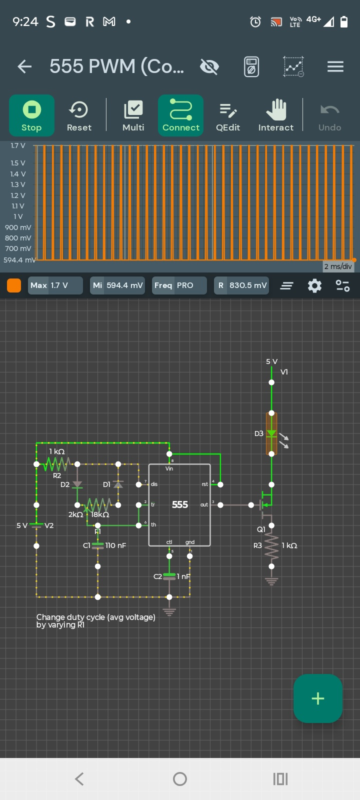

📘 555 PWM Duty‑Cycle Control (Adjustable R1)
A 555‑timer‑based PWM generator where the duty cycle (average output voltage) is controlled by adjusting a variable resistor.

---

🔧 Components Used
- 555 Timer IC  
- Variable Resistor R1 (18 kΩ)  
- R2 = 1 kΩ  
- R3 = 1 kΩ  
- Diodes: D1, D2, D3  
- Capacitors: C1 = 110 nF, C2 = 1 nF  
- Transistor Q1  
- DC Supply: 5 V  

---

⚙️ How the Circuit Works
This circuit uses a 555 timer in a PWM configuration.  
R1 controls the charge and discharge time of the timing capacitor through two separate diode paths.  
- When R1 increases, the charge time increases → higher duty cycle  
- When R1 decreases, the charge time decreases → lower duty cycle  

The 555 compares the capacitor voltage to its internal thresholds, generating a PWM output whose pulse width changes smoothly as R1 is adjusted.  
This is a classic method for controlling LED brightness, motor speed, and power delivery.

---

📊 Simulation Details
- Supply Voltage: 5 V  
- Output Type: PWM  
- Duty Cycle: Adjustable via R1  
- Waveform Range: ~0.6 V to ~1.7 V (simulation‑dependent)  
- Time Scale: 2 ms/div  

---

🖼️ Circuit & Waveform Image
This project uses a single combined image showing both the circuit and the oscilloscope output.

---

💡 Practical Notes
- Increasing R1 increases duty cycle (higher average voltage).  
- Diodes D1/D2 split charge/discharge paths for asymmetric timing.  
- C2 stabilizes the control pin for cleaner PWM.  
- Q1 can be used to drive higher‑current loads.  

---

📁 Project Files
👉 https://github.com/ArakelTheDragon/Library_Other/tree/main/555_PWM

---

🔗 Related CfCbazar Tutorials
- 555 Timer Basics  
- Astable Oscillator  
- PWM Motor Driver

---

🛒 CfCbazar Store
Support CfCbazar by getting our digital guides on electronics, DIY, smart living, cooking, games, and music tools:  
https://www.ebay.com/usr/cfcbazar
