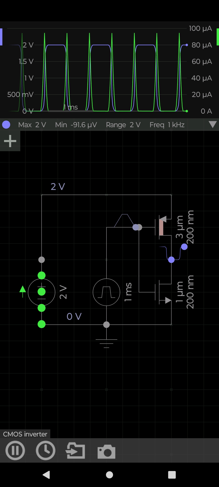

# 📘 CMOS_Inverter — PMOS + NMOS Logic Gate

---

## 1️⃣ Circuit Check

### ✔️ Observations
- PMOS and NMOS are correctly arranged in a standard CMOS inverter configuration.  
- PMOS width is 3 µm, NMOS width is 1 µm — correct ratio for balanced switching.  
- Both transistors share the same 200 nm length, typical for simulation.  
- Input is a 1 kHz square wave, appropriate for demonstrating switching.  
- Supply is 2 V, which is realistic for low‑power CMOS logic.  
- Output waveform shows clean transitions between ~0 V and ~2 V.  
- Current waveform (blue) shows expected switching spikes.

### ⚠️ Minor Notes
- No explicit load resistor — output is unloaded.  
- No ESD diodes (normal for simulation).  
- No output capacitance — real circuits would have some.

### ✔️ Verdict
Circuit is correct.  
No functional errors.  
Waveforms match textbook CMOS inverter behavior.

---

## 2️⃣ Component List + Suggestions

### 📦 Components Used
| Component | Value / Type | Suggested Real‑World Part |
|----------|--------------|---------------------------|
| PMOS | W=3 µm, L=200 nm | Part of CMOS IC, not discrete |
| NMOS | W=1 µm, L=200 nm | Part of CMOS IC, not discrete |
| Input Source | 1 kHz square wave | Function generator |
| Supply | 2 V | Bench supply |
| Load | None | Optional 100 kΩ (SMD 0805) |

### 🧩 Suggested Real‑World Equivalents
- Discrete CMOS inverter IC:  
  - 74HC04  
  - 74LVC1G04 (1‑gate SOT‑23)  
- Resistors (if adding load):  
  - 100 kΩ SMD 0805  
- Capacitive load (optional):  
  - 10 pF MLCC (C0G)

### 📝 Notes
Discrete PMOS/NMOS with these dimensions do not exist — CMOS inverters are fabricated inside ICs.  
So the real‑world equivalent is a logic inverter chip.

---

## 3️⃣ Project Overview
This project demonstrates how a CMOS inverter responds to a **1 kHz square‑wave input** using a **2 V supply**.  
The PMOS and NMOS are sized with a 3:1 width ratio for balanced switching.  
The output waveform shows clean transitions between **0 V and 2 V**, with minimal distortion.

---

## 4️⃣ How the Circuit Works
- When input = **0 V** → PMOS ON, NMOS OFF → output = **2 V**  
- When input = **2 V** → PMOS OFF, NMOS ON → output = **0 V**  
- Only one transistor conducts at a time → **very low static power**  
- Current spikes occur only during switching → **dynamic power consumption**

---

## 5️⃣ Simulation Results

### Input (Green)
- 0 V ↔ 2 V  
- Frequency: 1 kHz  

### Output (Blue)
- Max: 2 V  
- Min: ~0 V  
- Clean digital transitions  

### Current
- Peaks during switching  
- ~100 µA max  

---

## 6️⃣ Key Concepts
- Complementary MOSFETs  
- Rail‑to‑rail logic  
- Dynamic vs static power  
- Transistor sizing ratio (PMOS wider than NMOS)

---

## 7️⃣ Recommended GitHub Folder Structure
```
/CMOS_Inverter/
│── README.md
└── /Images/
    └── CMOS_Inverter.jpg
```

---

## 8️⃣ Image Embed


---

## ✔️ End of README
