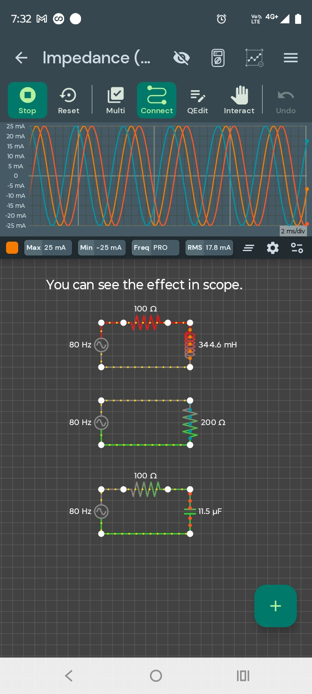

📘 Impedance Demo — Resistor, Inductor & Capacitor at 80 Hz

A visual comparison of how resistive, inductive, and capacitive circuits behave when driven by the same AC source. The oscilloscope shows how current amplitude and phase shift change depending on the component’s impedance at 80 Hz.

---

🔧 Components Used
- AC Voltage Source (80 Hz)  
- Resistor: 100 Ω  
- Inductor: 344.6 mH  
- Capacitor: 11.5 µF  
- Additional resistor: 200 Ω (pure resistive reference)

---

⚙️ How the Circuit Works
This project demonstrates how impedance affects AC current.  
Three circuits are driven by the same 80 Hz AC source:

1. Resistor Only (200 Ω)  
   - Current is in phase with voltage.  
   - Waveform is clean and predictable.

2. Inductor + Resistor (100 Ω + 344.6 mH)  
   - Inductive reactance increases with frequency.  
   - Current lags the voltage.  
   - Current amplitude decreases due to higher impedance.

3. Capacitor + Resistor (100 Ω + 11.5 µF)  
   - Capacitive reactance decreases with frequency.  
   - Current leads the voltage.  
   - Current amplitude increases due to lower impedance.

The oscilloscope clearly shows the phase differences and current magnitudes, making this a perfect beginner‑friendly demonstration of AC impedance.

---

📊 Simulation Details
- Frequency: 80 Hz  
- Measured Current Range: ±25 mA  
- RMS Current: ~17.8 mA (varies by circuit)  
- Waveform Type: AC sine  
- Time Scale: 2 ms/div  

---

🖼️ Circuit & Waveform Image
This project uses a single combined image showing all three circuits and the oscilloscope output.

---

💡 Practical Notes
- Inductive reactance: \( X_L = 2\pi f L \) → increases with frequency.  
- Capacitive reactance: \( X_C = \frac{1}{2\pi f C} \) → decreases with frequency.  
- Pure resistors do not shift phase.  
- Inductors cause lag, capacitors cause lead.  
- This is the foundation of AC analysis, filters, and resonance.

---

📁 Project Files
👉 (Insert your GitHub folder link here once created)

---

🔗 Related CfCbazar Tutorials
- AC Basics  
- RC Low‑Pass Filter  
- RL High‑Pass Filter

---

🛒 CfCbazar Store
Support CfCbazar by getting our digital guides on electronics, DIY, smart living, cooking, games, and music tools:  
https://www.ebay.com/usr/cfcbazar
