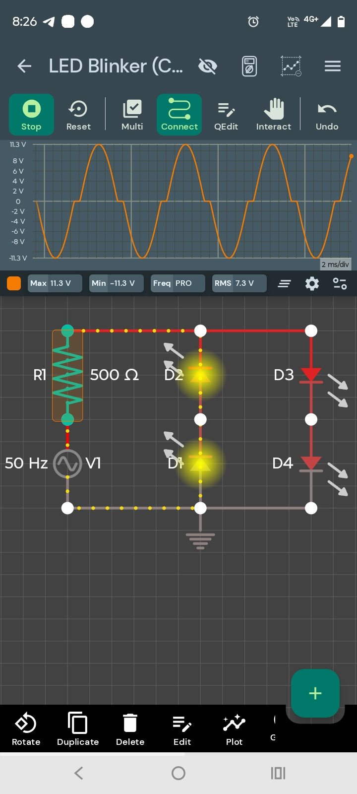

📘 LED Blinker (AC 50 Hz)

A simple AC‑driven LED blinker that uses a diode arrangement to alternate LED conduction on each half‑cycle of a 50 Hz AC waveform.

---

🔧 Components Used
- AC Voltage Source (50 Hz)  
- 4× Diodes (D1–D4)  
- 1× LED Load (alternating conduction)  
- 500 Ω Resistor (R1)

---

⚙️ How the Circuit Works
This circuit uses a 50 Hz AC source feeding a diode network that behaves like a simplified bridge.  
During the positive half‑cycle, current flows through one LED path, lighting D1/D2.  
During the negative half‑cycle, current reverses and lights D3/D4.  
The result is an alternating LED blink at 50 Hz — too fast to see with the naked eye, but clearly visible in simulation.  
This demonstrates AC rectification, diode polarity, and LED conduction behavior.

---

📊 Simulation Details
- Input Frequency: 50 Hz  
- Peak Voltage: ~±11.3 V  
- RMS Voltage: ~7.3 V  
- Waveform: AC sine  
- Time Scale: 2 ms/div  

---

🖼️ Circuit & Waveform Image
This project uses a single combined image showing both the circuit and the oscilloscope output.

---

💡 Practical Notes
- LEDs won’t visibly blink at 50 Hz — simulation reveals the alternation.  
- Different LED colors show different conduction thresholds.  
- Increasing frequency reduces LED conduction time per cycle.

---

📁 Project Files
👉 https://github.com/ArakelTheDragon/Library_Other/blob/main/LED_Blinker/

---

🔗 Related CfCbazar Tutorials
- MOSFET Driver  
- BJT Switch  
- Bridge Rectifier

---

🛒 CfCbazar Store
Explore more guides, kits, and digital tools:  
https://www.ebay.com/usr/cfcbazar
