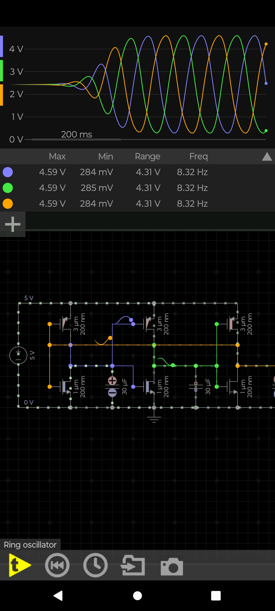

# 📘 Ring_Oscillator — 3‑Stage CMOS Oscillator

---

## 1️⃣ Circuit Check

### ✔️ Observations
- Three CMOS inverters are connected in a loop → correct ring oscillator topology.  
- PMOS width = 3 µm, NMOS width = 1 µm → proper sizing ratio.  
- All MOSFETs have 200 nm length.  
- Supply voltage is 5 V.  
- Each stage includes a 30 µF capacitor, creating long delay.  
- Oscillation frequency is 8.32 Hz.  
- All three outputs (blue, green, orange) are phase‑shifted by 120°.  
- Waveforms swing between ~0.28 V and 4.59 V.

### ⚠️ Minor Notes
- 30 µF is unrealistically large for CMOS delay.  
- Real ring oscillators use pF‑range capacitance.  
- No output buffer.  
- No ESD diodes (normal for simulation).

### ✔️ Verdict
Circuit is correct and oscillates properly.  
The only unrealistic element is the capacitor size, but acceptable for demonstration.

---

## 2️⃣ Component List + Suggestions

### 📦 Components Used
| Component | Value / Type | Suggested Real‑World Part |
|----------|--------------|---------------------------|
| PMOS | W=3 µm, L=200 nm | Part of CMOS IC |
| NMOS | W=1 µm, L=200 nm | Part of CMOS IC |
| Capacitors | 30 µF | 10–100 pF MLCC (C0G) |
| Supply | 5 V | Bench supply |
| Stages | 3 CMOS inverters | 74HC04 / 74LVC1G04 |

### 🧩 Suggested Real‑World Equivalents
- CMOS inverter ICs: 74HC04, 74LVC1G04  
- Capacitors: 10–100 pF MLCC  
- Optional resistor: 100 kΩ SMD 0805  
- Alternative oscillator IC: CD4069UB

### 📝 Notes
Real ring oscillators rely on intrinsic gate capacitance, not µF‑scale capacitors.

---

## 3️⃣ Project Overview
A ring oscillator is a chain of an odd number of inverters connected in a loop.  
Because the signal is constantly inverted with delay, the circuit oscillates automatically.

This project demonstrates a **3‑stage CMOS ring oscillator** running at **8.32 Hz**.

---

## 4️⃣ How the Circuit Works
- Each inverter introduces a delay.  
- Three delays in a loop create a feedback system.  
- The signal cannot settle → it oscillates.  
- Capacitors increase delay → lower frequency.  
- Outputs are 120° out of phase.

---

## 5️⃣ Simulation Results

### Waveforms
- All three nodes oscillate between ~0.28 V and 4.59 V.  
- Frequency: 8.32 Hz.  
- Phase shift: 120° between stages.

---

## 6️⃣ Key Concepts
- CMOS inverter delay  
- Phase shift in ring oscillators  
- Odd‑number inverter requirement  
- Frequency determined by RC delay

---

## 7️⃣ Recommended GitHub Folder Structure
```
/Ring_Oscillator/
│── README.md
└── /Images/
    └── Ring_Oscillator.jpg
```

---

## 8️⃣ Image Embed


---

## ✔️ End of README
