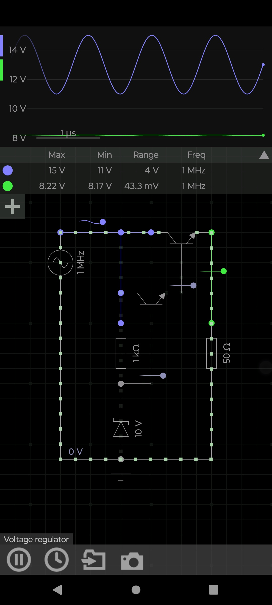

# 📘 Voltage Regulator — Transistor + Diode Stabilizer  
A simple high‑frequency voltage regulator that converts a fluctuating AC input into a stable DC‑like output.

---

## 🔧 Project Overview  
This circuit demonstrates how a **diode reference** and **transistor pair** can regulate voltage even when the input signal varies rapidly.  
The input is a **1 MHz AC waveform** swinging between **11 V and 15 V**, and the regulator outputs a stable **≈ 8.2 V** with only **43 mV ripple**.

This is a classic analog stabilizer used in RF, audio, and sensor front‑ends.

---

## 🧩 Circuit Components  
- **1 MHz AC Source** — unstable input  
- **1 kΩ Resistor** — input current limiter  
- **50 Ω Resistor** — load resistor  
- **10 V Diode** — reference clamp  
- **Two BJTs** — emitter‑follower regulation stage  
- **Output Node** — regulated voltage (~8.2 V)

---

## 🧠 How the Regulator Works  
1. The **10 V diode** sets a reference voltage.  
2. The **first transistor** buffers the diode reference.  
3. The **second transistor** provides current gain and stabilizes the output.  
4. High‑frequency variations at 1 MHz are absorbed by the transistor junctions.  
5. The output remains nearly constant even when the input swings by 4 V.

This is essentially a **discrete linear regulator**.

---

## 📉 Simulation Results  
### Input (Blue Trace)  
- Max: **15 V**  
- Min: **11 V**  
- Range: **4 V**  
- Frequency: **1 MHz**

### Output (Green Trace)  
- Max: **8.22 V**  
- Min: **8.17 V**  
- Ripple: **43.3 mV**  
- Frequency: **1 MHz**

The regulator reduces a **4 V input swing** down to **0.043 V ripple** — a **92× improvement**.

---

## 🧮 Key Concepts  
### 🔹 Diode Reference  
A diode (or Zener) sets a stable voltage drop.

### 🔹 Emitter Follower  
Transistor output ≈ diode reference − 0.7 V.

### 🔹 Ripple Reduction  
High‑frequency noise is absorbed by transistor junction capacitances.

---

## 📁 Recommended GitHub Folder Structure  
```
/VoltageRegulator_BJT/
│── README.md
└── /Images/
    └── circuit.jpg
```

---

## 🖼️ Image Embed (for README)  
```

```

---

## 🎥 Optional: YouTube Short Script  
**Title:** Transistor Voltage Regulator Explained Fast  

**Script:**  
- Show unstable 1 MHz input  
- Show diode + transistor regulator  
- Show stable 8.2 V output  
- Text overlay: “4 V ripple → 43 mV ripple”  
- End with CfCbazar branding

---

## ✔️ End of README
